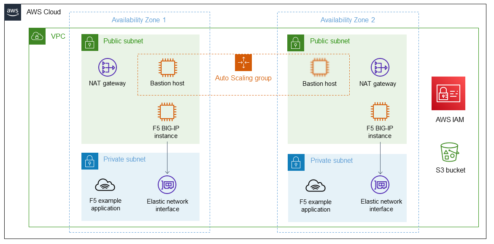

__F5 BIG-IP Account Factory Customization__
 
This solution deploys the following
 
- A highly available architecture that spans two Availability Zones.*
- A VPC configured with public and private subnets, according to AWS best practices, to provide you with your own virtual network on AWS.*
 
In the public subnets:
- Managed NAT gateways to allow outbound internet access for resources in the private subnets.*
- A Linux bastion host in an Auto Scaling group to allow inbound Secure Shell (SSH) access to EC2 instances in public and private subnets.*
- BIG-IP VE deployed to Amazon Elastic Compute Cloud (Amazon EC2) instances.
 
In the private subnets:
- An example application to help demonstrate BIG-IP VE functionality.

As well as:

- An Amazon S3 SSE-S3 encrypted bucket used to provide failover state.
- AWS Identity and Access Management (IAM) Instance Profile to allow BIG-IP to remap Network resources and access the S3 Bucket for failover state.

This solution is for infrastructure engineers, platform engineers and security engineers and provides a validated configuration point for BIG-IP usecases in AWS. For more detail of the template, options and other F5 related information please see:
 

__Architecture__
 

 
__How to use this Template__
 
This template can be deployed in one or more regions and uses 2 AWS Availability zones.
 
The following parameters are required:
 
| Parameter | Description | Type |  Default | Allowed Values |
|------------------|--------------------------------|-------------|--|------------------|
| availabilityZones | List of Availability Zones to use for the subnets in the VPC. Select or provide 2 Availability Zones. Note: The logical order is preserved and only 2 AZs are used for this deployment. | string *(rendered list)* | | Select 2 AZs from your region. |
| cfeS3Bucket | Provide a unique name for an S3 Bucket to create for Cloud Failover Extension storage. | string |  | Unique Name for S3 Bucket | 
| remoteAccessCIDR | Allowed CIDR block for external SSH access to the bastions. | string | | The IPv4 address range, in CIDR format. |
| restrictedSrcAddressApp | The IP address range that can be used to access web traffic (80/443) to the EC2 instances. Ex. 0.0.0.0/0 for public access. 10.0.0.0/8 for private access. | string | | The IPv4 address range, in CIDR format. |        
| restrictedSrcAddressMgmt | The IP address range used to SSH and access BIG-IP management port. Restrict to your client IP or trusted network. Ex. X.X.X.X/32 or 10.0.0.0/8. WARNING - For eval purposes only. Production should never have Management interface exposed to Internet. | string | | The IPv4 address range, in CIDR format. |

 
When deploying this template, you can change the following parameters.
 
| Name |  Description | Type | Default | Allowed Values |
|------|--------------|------|---------|----------------|
| allowUsageAnalytics | This deployment can send anonymous statistics to F5 to help us determine how to improve our solutions. If you select **false** statistics are not sent. | string | true | true/false |          
| appDockerImageName | Application docker image name | string | f5devcentral/f5-demo-httpd:latest | any docker image |      
| application | Name of the Application Tag | string | f5app | any string |
| availabilityZones | List of Availability Zones to use for the subnets in the VPC. Select or provide 2 Availability Zones. Note: The logical order is preserved and only 2 AZs are used for this deployment. | string *(rendered list)* | | Select 2 AZs from your region | 
| bigIpImageId | For use with a custom AMI | string | | AMI you have access to|                               
| bigIpImageName | F5 BIG-IP Performance Type | List | Best | Various / Listed Offers |    
| bigIpInstanceType | AWS instance type | string *(rendered list)* | m5.2xlarge | Various / Listed offers |
| bigIpRuntimeInitConfig01 | Supply a URL to the bigip-runtime-init configuration file in YAML or JSON format to use for f5-bigip-runtime-init configuration for first BIG-IP. | string | https://aws-quickstart.s3.amazonaws.com/quickstart-f5-big-ip-virtual-edition-ha/declarations/runtime-init-conf-2nic-payg-instance01.yaml | Any public or local url that BIG-IP can access |
| bigIpRuntimeInitConfig02 | Supply a URL to the bigip-runtime-init configuration file in YAML or JSON format to use for f5-bigip-runtime-init configuration for second BIG-IP. | string | https://aws-quickstart.s3.amazonaws.com/quickstart-f5-big-ip-virtual-edition-ha/declarations/runtime-init-conf-2nic-payg-instance02.yaml | Any public or local url that BIG-IP can access |
| bigIpRuntimeInitPackageUrl | Supply a URL for the F5 BIG-IP Runtime Init Package install script. | string | https://cdn.f5.com/product/cloudsolutions/f5-bigip-runtime-init/v1.5.1/dist/f5-bigip-runtime-init-1.5.1-1.gz.run | Any public or local url for Runtime-Init package that BIG-IP can access |
| bigIpThroughput | Maximum amount of throughput for BIG-IP VE | string *(rendered list)* | 1000Mbps | rendered list |
| cfeS3Bucket | Provide a unique name for an S3 Bucket to create for Cloud Failover Extension storage. | string |  | Unique Name for S3 Bucket |                                  
| cfeTag | Cloud Failover deployment tag value.  | string |aws_quickstart | any string | 
| cfeVipTag | Cloud Failover VIP tag value; provides private ip addresses to be assigned to VIP public ip. | string | 10.0.20.101,10.0.10.101 | 2 IPs from public subnets |      
| cost | Cost Center Tag | string | f5cost | any string |
| environment | Environment Tag | string | f5env | any string |
| group | Group Tag | string | f5group | any string |  
| keyPairName | Name of an existing EC2 KeyPair to enable SSH access to EC2 instances which include BIG-IP, Bastion, and demo application instances. If left empty, one will be created. | string *(rendered list)* | | existing AWS key pair name. Otherwise, one will be generated. |                             
| owner | Owner Tag | string | f5owner | any string |   
| peerConfigSyncAddr | Provide the static address of the remote peer used for clustering. In this failover solution, clustering is initiated from the second instance (02) to the first instance (01) so you would provide the first instances Self IP address. Customize to match your network.  | string | 10.0.10.11 | IP address of peer Self-IP |               
| privateSubnet1ACIDR | Management net for BIG-IP 1. CIDR block for private subnet 1 located in Availability Zone 1 | string | 10.0.11.0/24 | The IPv4 address range, in CIDR format. Must include privateSubnet1ASelfAddress.  |  
| privateSubnet1ASelfAddress | Management IP for BIG-IP 1. Provide a static IP address for private subnet 1 in Availability Zone 1. Customize to match your network. | string | 10.0.11.11 | IP address from privateSubnet1A range.  |   
| privateSubnet1BCIDR | Application net in AZ1. CIDR block for private subnet 2 located in Availability Zone 1. | string | 10.0.12.0/24 | The IPv4 address range, in CIDR format. |          
| privateSubnet2ACIDR | Management net for BIG-IP 2. CIDR block for private subnet 1 located in Availability Zone 2. | string | 10.0.21.0/24     | The IPv4 address range, in CIDR format. Must include privateSubnet2ASelfAddress |
| privateSubnet2ASelfAddress | Management IP for BIG-IP 2. Provide a static Management IP address for private subnet 1 in Availability Zone 2. Customize to match your network. | string | 10.0.21.11 | IP address from privateSubnet2A range. |            
| privateSubnet2BCIDR | Application Net in AZ2. CIDR block for private subnet 2 located in Availability Zone 2 | string | 10.0.22.0/24 | The IPv4 address range, in CIDR format.|          
| provisionExampleApp | Flag to deploy the demo web application. | string *(rendered list)* | false | true/false |            
| publicSubnet1CIDR | CIDR block for the public subnet located in Availability Zone 1. | string | 10.0.10.0/24 | The IPv4 address range, in CIDR format.|           
| publicSubnet1SelfAddress | External Self IP for BIG-IP 1. Provide a static IP address for the public subnet in Availability Zone 1. Customize to match your network.  | string | 10.0.10.11 | IP address |
| publicSubnet1VipAddress | Provide a Virtual Service IP address in the public subnet in Availability Zone 1. Customize to match your network.  | string | 10.0.10.101 | IP address |
| publicSubnet2CIDR | CIDR block for the public subnet located in Availability Zone 2. | string | 10.0.20.0/24 | The IPv4 address range, in CIDR format. |        
| publicSubnet2SelfAddress | External Self IP for BIG-IP 2.  Provide a static IP address for the public subnet in Availability Zone 2. Customize to match your network. | string | 10.0.20.11 | IP address |
| publicSubnet2VipAddress | Provide a Virtual Service IP address in the public subnet in Availability Zone 2. Customize to match your network.  | string | 10.0.20.101 | IP address |      
| qss3BucketName | S3 bucket name for the modules. S3 bucket name can include numbers, lowercase letters, uppercase letters, and hyphens (-). It cannot start or end with a hyphen (-). | string | aws-quickstart | public bucket with all files |
| qss3BucketRegion | Region where the Quick Start S3 bucket (qss3BucketName) is hosted. When using your own bucket, you must specify this value.  | string | us-east-1 | region hosting your templates if not using default. | 
| qss3KeyPrefix | S3 key prefix for the Quick Start assets. Quick Start key prefix can include numbers, lowercase letters, uppercase letters, hyphens (-), and forward slash (/). | string | quickstart-f5-big-ip-virtual-edition-ha/ | appropriate search string |
| remoteAccessCIDR | Allowed CIDR block for external SSH access to the bastions. | string | | The IPv4 address range, in CIDR format. |
| restrictedSrcAddressApp | The IP address range that can be used to access web traffic (80/443) to the EC2 instances. Ex. 0.0.0.0/0 for public access. 10.0.0.0/8 for private access. | string | | The IPv4 address range, in CIDR format. |        
| restrictedSrcAddressMgmt | IP address to access BIG-IP mgmt interfaces | string | | The IPv4 address range, in CIDR format. |       
| secretArn | ARN of an existing AWS Secrets Manager secret. If left empty, a secret will be created. | string | | existing secret arn. otherwise, a secret is generated if not provided |              
| uniqueString | Unique String used when creating object names or tags. | string | myUniqStr | a string between 1 and 12 alphanumeric characters with first character as a letter |
| vpcCIDR | CIDR range for VPC | string | 10.0.0.0/16 | The IPv4 address range, in CIDR format. |
